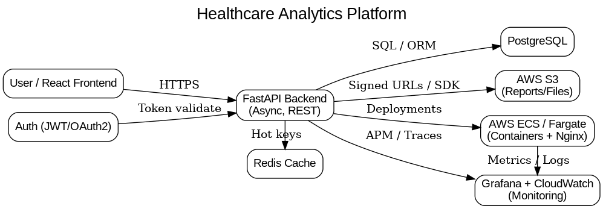
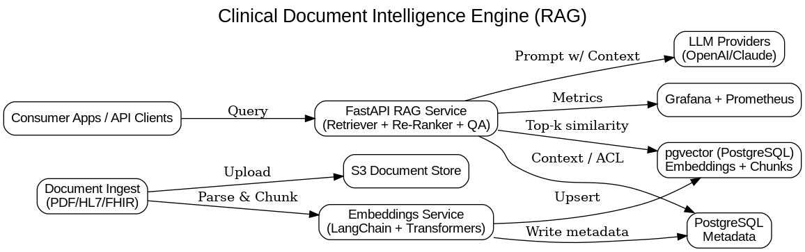
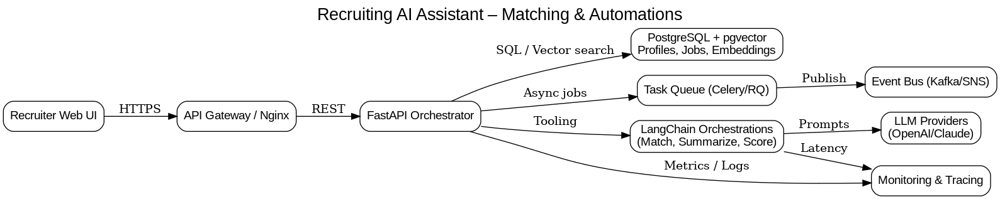
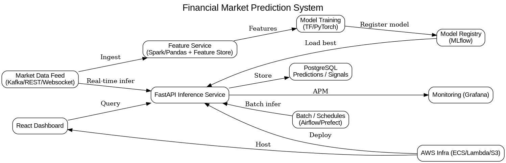

# Teja Bailraju — Backend Developer | FastAPI | AI Integrations

Welcome to my portfolio — this repository highlights a few of my most impactful backend and AI-driven projects, complete with architecture diagrams.

---

## 🩺 1. Healthcare Analytics Platform

- Built scalable FastAPI microservices for healthcare data ingestion and analytics.
- Optimized PostgreSQL queries for large datasets.
- Automated CI/CD deployment to AWS ECS with Docker.
- Monitored with Grafana and CloudWatch.

---

## 🧠 2. Clinical Document Intelligence Engine (RAG)

- Implemented LangChain + OpenAI + pgvector for semantic search across clinical documents.
- Deployed a HIPAA-compliant FastAPI RAG pipeline.
- Reduced query time by 60% using vector indexing and caching.

---

## 🤖 3. Recruiting AI Assistant

- Developed AI-powered recruitment assistant using FastAPI + LangChain.
- Integrated LLM-based candidate matching with pgvector.
- Deployed on AWS with Docker and asynchronous job queues.

---

## 💹 4. Financial Market Prediction System

- Built LSTM-based prediction models in TensorFlow.
- Integrated Django + React frontend for real-time visualization.
- Used PostgreSQL for storing predictions and AWS Lambda for batch processing.

---

### 📬 Contact
📧 **tejabailraju7@gmail.com**  
🌐 [GitHub](https://github.com/tejabail12) | [LinkedIn](https://www.linkedin.com/in/teja-bailraju510)

---

⭐ **Tip:** You can walk through these diagrams during your Semantic Recruitment interview to visually explain your architecture and design process.
